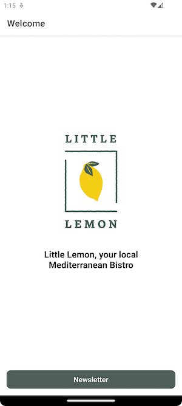

## Little Lemon

This is the final project for the React Native course by Meta on Coursera.

See https://www.coursera.org/learn/react-native-course

IOS Screenshots

Welcome Screen

Subscribe Screen

Alert Dialog

Android Screenshots

Welcome Screen

Subscribe Screen

Alert Dialog

Imagined TODOs
- Create a component for the Button used on both screens
- On Android: clicking subscribe while the keyboard is open only closes the keyboard. It would be better to show the alert instead of closing the keyboard (or do both)